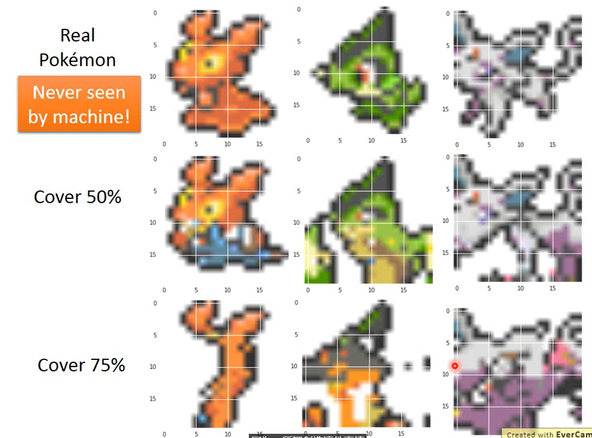
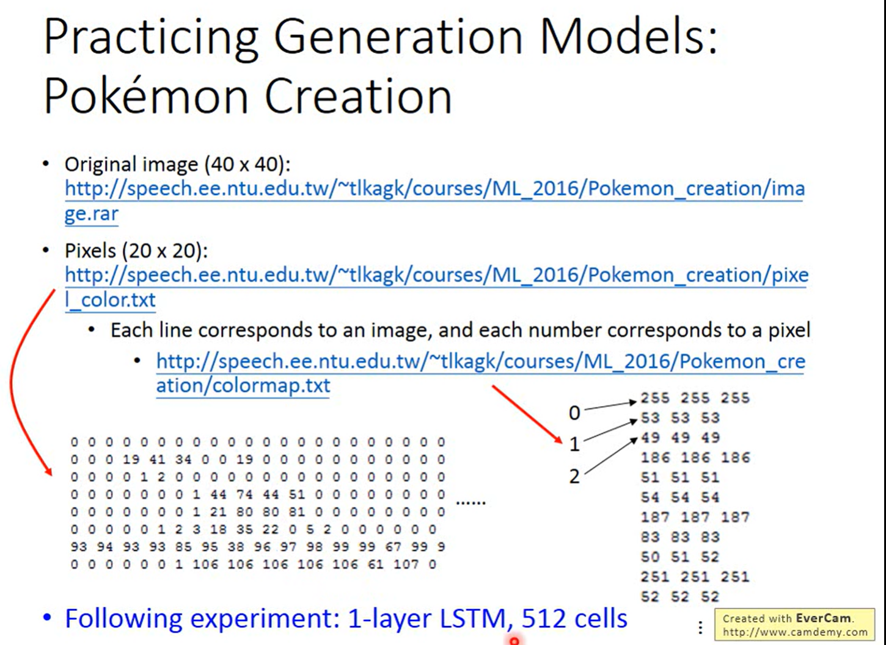
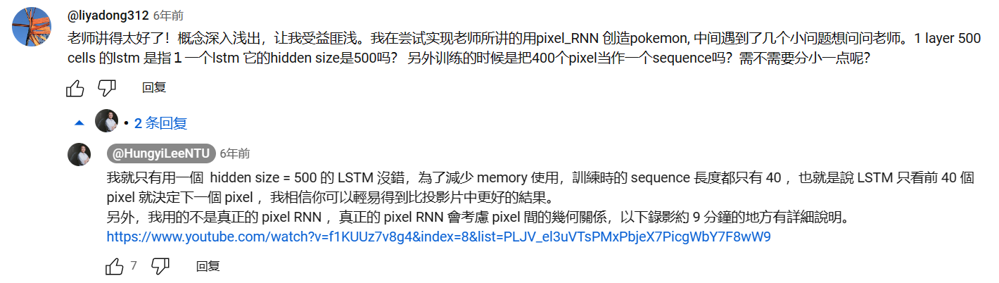
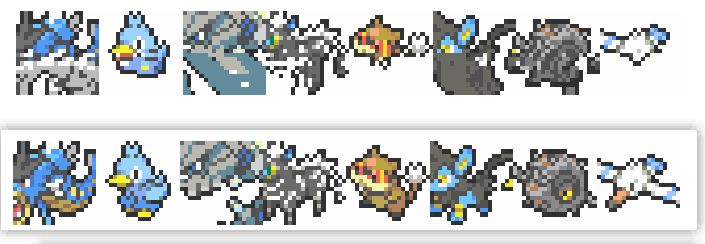
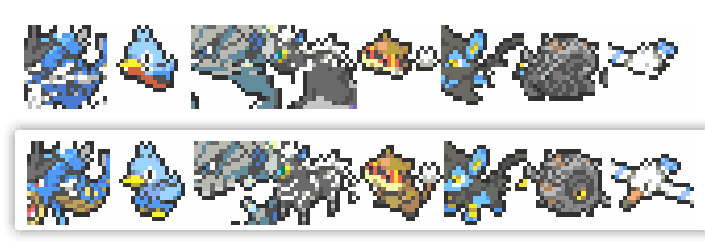

# 李宏毅（Hung-yi Lee）机器学习 ML Lecture 17: Pokemon Creation


本仓库使用Pytorch实现了课程中的宝可梦生成练习，即通过简单的LSTM模型实现一个简化版本的PixelRNN并实现Pokemon生成的任务。模型设置参考自李老师的视频和评论区的回复。
## 课程所提供的各种信息：
- 课程链接：[[Youtube] ML Lecture 17: Unsupervised Learning - Deep Generative Model (Part I)](https://www.youtube.com/watch?v=YNUek8ioAJk&list=PLJV_el3uVTsPy9oCRY30oBPNLCo89yu49&index=27)
- 数据集下载链接：
  - **注意：因为修改后的数据集很小，所以本仓库已经包含了所需要的所有数据集！这里只是下载链接的备忘录！！！**
  - [聚类后的色彩映射关系mapping](https://speech.ee.ntu.edu.tw/~tlkagk/courses/ML_2016/Pokemon_creation/colormap.txt)
  - [修剪后的20x20图像数据集，已经清洗为txt文件](https://speech.ee.ntu.edu.tw/~tlkagk/courses/ML_2016/Pokemon_creation/pixel_color.txt)
  - [原始40x40的图像数据集（仅供查看宝可梦的图片，实验本身不需要这个）](https://speech.ee.ntu.edu.tw/~tlkagk/courses/ML_2016/Pokemon_creation/image.rar)
- 使用的模型信息参考：
  - 
  - 
## 本仓库简介
### 任务简介
- 通过在700余张宝可梦图像中学习宝可梦合理的生成序列方式，对于模型没有见过的宝可梦进行预测生成。具体来说只给模型一部分开始的像素，让其逐一预测后续的像素排布，完成预测。
- 特别的，为了简化任务难度和序列长度，老师已经提前对于颜色进行聚类，只保留了167种不同的颜色，并通过[colormap.txt](./colormap.txt)进行保存，具体请参考课程视频。**所以LSTM只需要处理长度为167的one-hot向量序列即可**，任务难度被大幅简化。
### 模型简介
- 老师仅使用了非常弱化版的，只考虑了1维序列信息的LSTM作为主要模型，甚至没有考虑像素点的2维关系（真正的PixelRNN和PixelCNN）。但是却实现了不错的观感，生成的宝可梦也都比较合理，所以这里完全follow老师的各种设置进行复现。
- 学习率使用了Warm up和COS规划两个技术。
### 文件简介：
- [main.py](main.py)：训练的主入口
- `utils`文件夹：包含了各种训练所需的包，读取本项目特殊的RGB图像，以及lr规划等等功能都在里面，
- [colormap.txt](colormap.txt)：使用到的颜色索引到RGB的映射关系
- [pixel_color.txt](pixel_color.txt)：实际存储了训练所需的数据集。
### 使用方法：
按照如下指令可以训练过程，并通过Tensorboard实时查看生成效果。

- 训练启动：
  ```bash
  python main.py
  ```
  特别的，可以通过命令行参数设置如下种种训练参数，默认值请参考[main.py](main.py)中的`get_args_parser`函数：
  ```
  options:
  -h, --help            show this help message and exit
  --batch_size BATCH_SIZE
                        Batchsize per GPU
  --seq_len SEQ_LEN     Batchsize per GPU
  --output_dir OUTPUT_DIR
                        output dir for ckpt and logs
  --epoch EPOCH         Number of epochs
  --lr LR               Learning rate
  --device DEVICE       Device: cuda or GPU
  --test_period TEST_PERIOD
                        Test when go through this epochs
  --mask_rate MASK_RATE
                        masked rate of the input images
  --save_period SAVE_PERIOD
                        masked rate of the input images
  --warmup_epochs WARMUP_EPOCHS
                        warmup epochs
  --min_lr MIN_LR       min lr for lr schedule
  --seed SEED           random seed init
  ```

- Tensorboard监视训练过程：
  - 在安装了Tensorboard之后，在当前工作路径中使用如下命令，并通过浏览器打开对应本地域名即可实现监视训练过程：
    ```bash
    tensorboard --logdir ./
    ```

### 一些调参tips
- lr基本就是1e-3是比较理想的
- 目前默认为5000epoch，目测到10000epoch也是一个合理的参数。
- batch_size可以根据不同的设备适当调整，可能也需要跟着调整epoch和lr
- **可以多做尝试，多换学习率和随机种子，有好的结果或者不好的结果可以在本仓库的discussion版块一起讨论。**


### 一些生成结果展示






